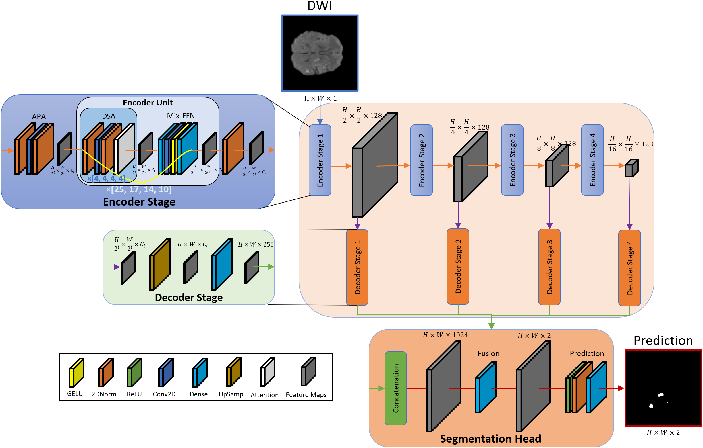

# Lesion-Net: Small Lesion Segmentation in Acute Ischemic Stroke



> This is an official implementation of [Lesion-Net: Small Lesion Segmentation in Acute Ischemic Stroke]() <br>

**Release date:** 15/Dec/2025

## Abstract
Accurate segmentation of acute ischemic stroke in MRI remains a significant challenge due to the presence of small and subtle lesions. Lesion-Net is an attention-based segmentation model designed for accurate small-lesion segmentation in brain MRI, with a focus on acute ischemic stroke. The architecture features a hierarchical encoder, lightweight decoder, and fusion-based segmentation head, with reduced spatial down-sampling and enhanced shallow-layer capacity to preserve fine lesion details. By prioritizing high-resolution features and uniform channel widths, Lesion-Net improves sensitivity to small lesions commonly missed by conventional designs. Experiments on ISLES 2022 and JHUS demonstrate strong performance and robustness in highly imbalanced small-lesion scenarios.

## Usage

### Installation
The framework was tested using Python 3.10, PyTorch 2.6, and CUDA 12.4. Ensure that you install all the dependencies listed in `requirements.txt`.

```
conda create -n lesion_net python=3.10
conda activate lesion_net
cd Lesion-Net
pip install -r requirements.txt
```

### Datasets
The ISLES 2022 dataset is publicly available and can be downloaded from [Kaggle](https://www.kaggle.com/datasets/orvile/isles-2022-brain-stoke-dataset). In contrast, the JHUS dataset is a restricted resource and can only be accessed through a formal data request submitted to [ICPSR](https://www.icpsr.umich.edu/web/ICPSR/studies/38464).

After placing the downloaded 3D volumes in `data/isles22/3d_data/`, generate 2D slices and patient-wise train/val/test splits using:
```bash
python make_dataset.py
```

```
data/
└─ isles22/
   ├─ 3d_data/ISLES-2022/
   │  └─ ...
   └─ 2d_data/
      ├─ images/
      │  ├─ train/
      │  ├─ val/
      │  └─ test/
      └─ labels/
         ├─ train/
         ├─ val/
         └─ test/
```

### Training & Evaluation
After setting the parameters in `config/config_train.yaml`, run the following command to train and evaluate the model:
```
python train.py
python evaluate.py
```

<!--
## Citation
If you find this work useful, please consider citing:

```bibtex

```
-->
